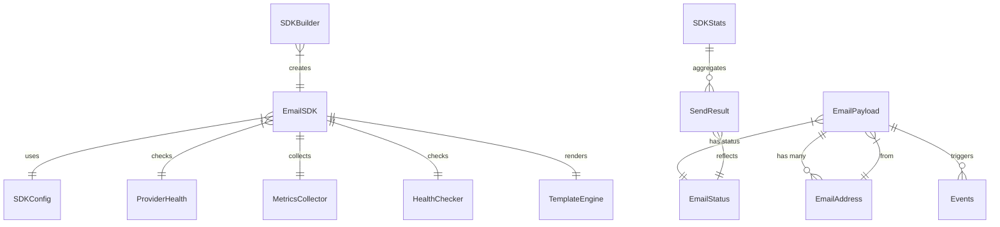

# Email SDK – End‑to‑End Architecture & ER Diagram

## Overview
The **Email SDK** provides a high‑performance, extensible way to send transactional emails. It abstracts delivery providers, queue management, templating, and analytics behind a clean TypeScript API.

---
### Core Concepts
- **`EmailPayload`** – The data model representing an email (recipients, content, metadata).
- **`EmailAddress`** – Reusable address object used for `from`, `to`, `cc`, `bcc`.
- **`EmailStatus`** – Enum describing the lifecycle of a message (queued, processing, sent, failed, retrying).
- **`SendResult`** – Result object returned after a send operation.
- **`Events`** – Typed events emitted during the send flow (`queued`, `sent`, `failed`, …).
- **`ProviderHealth`** – Health information for each configured email provider.
- **`SDKConfig`** – Configuration supplied to the builder (provider credentials, retry policy, etc.).
- **`SDKStats`** – Aggregated metrics (sent count, failure rate, latency, …).
- **`EmailSDK`** – The main class exposing `send`, `sendBulk`, `registerTemplate`, `getStats`, `healthCheck`, and event subscription.
- **`SDKBuilder`** – Fluent builder that wires together all dependencies and produces an `EmailSDK` instance.

---
## Data Flow (High‑Level)
1. **Client** creates an `EmailPayload` and calls `EmailSDK.send()` (or `sendBulk`).
2. The SDK **normalises** the payload, optionally renders a template via `TemplateEngine`.
3. The payload is **enqueued** in `EmailQueue`.
4. `QueueWorker` continuously dequeues items and forwards them to a `DeliveryEngine`.
5. `DeliveryEngine` selects an appropriate provider and attempts delivery.
6. Success or failure updates the `EmailStatus` and emits corresponding **events** via `EmailEventEmitter`.
7. `MetricsCollector` updates `SDKStats` for real‑time analytics.
8. `HealthChecker` can be queried to retrieve `ProviderHealth` for each configured provider.

---
## Entity‑Relationship Diagram (Mermaid)


---
## Detailed Component Breakdown
### 1. Types (`src/types`)
- **`EmailPayload.ts`** – Defines the shape of an email, including optional template fields.
- **`EmailStatus.ts`** – Enum for message lifecycle.
- **`SendResult.ts`** – Result returned to callers.
- **`SDKConfig.ts`** – Configuration interface used by the builder.
- **`SDKStats.ts`** – Metrics snapshot.
- **`ProviderHealth.ts`** – Health check result per provider.
- **`Events.ts`** – Event payload definitions.

### 2. Core (`src/core`)
- **`EmailSDK.ts`** – Orchestrates sending, queuing, event emission, and health checks.
- **`SDKBuilder.ts`** – Constructs the SDK with all required dependencies (queue, delivery engine, analytics, etc.).

### 3. Queue (`src/queue`)
- **`EmailQueue.ts`** – In‑memory queue storing pending messages.
- **`QueueWorker.ts`** – Background worker that processes the queue.
- **`DLQHandler.ts`** – Dead‑letter queue for permanently failed messages.

### 4. Delivery (`src/delivery`)
- **`DeliveryEngine.ts`** – Abstracts provider selection and actual email transmission.

### 5. Analytics (`src/analytics`)
- **`MetricsCollector.ts`** – Captures send latency, success/failure counts.
- **`HealthChecker.ts`** – Periodically pings providers to report health.

### 6. Events (`src/events`)
- **`EmailEventEmitter.ts`** – Emits typed events (`queued`, `sent`, `failed`, …) that consumers can subscribe to.

### 7. Templates (`src/templates`)
- **`ITemplateEngine.ts`** – Interface for rendering templates (e.g., Handlebars, MJML).
- **`TemplateCache.ts`** – Caches compiled templates for fast reuse.

---
## Usage Example (Simplified)
```ts
import { SDKBuilder } from "./src/core/SDKBuilder";
import { EmailAddress } from "./src/types/EmailPayload";

const sdk = new SDKBuilder()
  .withConfig({ /* provider credentials */ })
  .withProvider(/* provider implementation */)
  .build();

const payload = {
  from: { email: "no-reply@example.com" },
  to: [{ email: "user@example.com" }],
  subject: "Welcome!",
  html: "<p>Hello World</p>"
};

sdk.send(payload, { awaitResult: true }).then(console.log);
```

---
## Extensibility
- **Add a new provider** – Implement the `IProvider` interface and register it via `SDKBuilder`.
- **Custom metrics** – Extend `MetricsCollector` and expose additional stats through `SDKStats`.
- **Alternative queue** – Swap the in‑memory `EmailQueue` for Redis, RabbitMQ, etc., by providing a compatible queue implementation.

---
## Summary
The Email SDK is built around a clean **entity‑relationship model** that separates concerns: payload definition, status tracking, event emission, provider health, and analytics. The mermaid diagram above visualises these relationships, while the documentation explains the end‑to‑end flow from client code to final delivery.

*End of documentation.*
