# 📐 Email SDK — UML Diagrams
### Activity Diagram + Class Diagram (Academic / Professional Style)

> **File:** `docs/uml_diagrams.md`  
> **Project:** Email SDK — Provider-Agnostic TypeScript Email Delivery Library  
> **Standard:** UML 2.5 (rendered via Mermaid)

---

## TABLE OF CONTENTS

1. [UML Activity Diagram — System Workflow](#1-uml-activity-diagram--system-workflow)
2. [UML Class Diagram — System Architecture](#2-uml-class-diagram--system-architecture)
3. [Component Relationship Summary](#3-component-relationship-summary)

---

---

## 1. UML Activity Diagram — System Workflow

> Shows the complete lifecycle of an email from the moment `sdk.send()` is called to final delivery or dead-letter queue, including all decision branches, retries, fallback logic, and concurrency.

```mermaid
flowchart TD
    START(["●  START"]):::startNode

    subgraph swimlane_app ["🧑‍💻  CLIENT APPLICATION"]
        A1["Call sdk.send(payload)"]
        A2{"Has templateId?"}
        A3["Render HTML from\nTemplateCache + TemplateEngine"]
        A4{"Queue full?\n≥ 10,000 jobs"}
        A5["Throw QueueFullError\n(Back-pressure)"]
        A6["Enqueue job with\n(messageId, correlationId, priority)"]
        A7["Emit email.queued event"]
        A8{"awaitResult = true?"}
        A9["Return Promise\n(caller waits)"]
        A10["Return immediate\nSendResult (QUEUED)"]
    end

    subgraph swimlane_worker ["⚙️  QUEUE WORKER  (5 Concurrent Loops)"]
        B1["Poll queue every 100ms"]
        B2{"Job available &\nnextRetryAt ≤ now?"}
        B3["Sleep 100ms"]
        B4["Dequeue highest-priority job\n(high → normal → low, then FIFO)"]
        B5["Pass job to DeliveryEngine"]
    end

    subgraph swimlane_engine ["🧠  DELIVERY ENGINE"]
        C1["Get orderedAvailable()\nfrom FallbackChain"]
        C2{"Any provider\navailable?"}
        C3["No provider available\n→ check RetryPolicy"]
        C4["Loop: try each provider\nin priority order"]
        C5{"CircuitBreaker\nstate = OPEN?"}
        C6["Skip this provider\n→ try next"]
        C7["RateLimiter.acquire()\n(Token Bucket check)"]
        C8{"Token available?"}
        C9{"mode = 'wait'?"}
        C10["Wait up to 3s\nfor token refill"]
        C11["Throw RateLimitError"]
        C12["provider.send(payload)"]
        C13{"Send success?"}
        C14["breaker.recordSuccess()\nClosed circuit stays CLOSED"]
        C15["Return DeliveryDecision\n{ kind: 'sent' }"]
        C16["breaker.recordFailure()\n5 fails → circuit OPENS"]
        C17{"RetryPolicy:\nshouldRetry(error, attempt)?"}
        C18["Error code 400/401/422?\n→ Non-retryable"]
        C19["Error code 429/5xx?\n→ Retryable"]
        C20{"More providers\nin chain?"}
        C21["Try next provider\nin FallbackChain"]
        C22["All providers exhausted\n→ Return retry/failed decision"]
    end

    subgraph swimlane_retry ["🔄  RETRY / DLQ LOGIC"]
        D1{"DeliveryDecision\nkind?"}
        D2["Compute exponential delay:\nbaseDelay × 2^attempt + jitter"]
        D3["Set job.nextRetryAt = now + delay\nRe-enqueue job"]
        D4["Emit email.retrying event"]
        D5["Increment job.attempts"]
        D6{"attempts ≥ maxAttempts\nor non-retryable?"}
        D7["Send job to DLQHandler\n(Dead Letter Queue)"]
        D8["Emit email.failed event"]
        D9["Reject promise (if awaitResult)"]
    end

    subgraph swimlane_success ["✅  SUCCESS PATH"]
        E1["Emit email.sent event"]
        E2["MetricsCollector:\ntotalSent++, byProvider.sent++"]
        E3["Resolve promise (if awaitResult)"]
        E4["ConsoleLogger / FileLogger\nwrite JSON log entry"]
    end

    subgraph swimlane_obs ["📊  OBSERVABILITY  (Observer Pattern)"]
        F1["EmailEventEmitter\nbroadcasts event"]
        F2["ConsoleLogger\n→ JSON to stdout"]
        F3["FileLogger\n→ append to email.log"]
        F4["MetricsCollector\n→ update sliding window counters"]
    end

    END(["⬤  END"]):::endNode

    START --> A1
    A1 --> A2
    A2 -->|"Yes"| A3
    A3 --> A4
    A2 -->|"No"| A4
    A4 -->|"Yes"| A5
    A5 --> END
    A4 -->|"No"| A6
    A6 --> A7
    A7 --> A8
    A8 -->|"Yes"| A9
    A8 -->|"No"| A10
    A9 --> B1
    A10 --> B1

    B1 --> B2
    B2 -->|"No"| B3
    B3 --> B1
    B2 -->|"Yes"| B4
    B4 --> B5
    B5 --> C1

    C1 --> C2
    C2 -->|"None"| C3
    C3 --> D1
    C2 -->|"Available"| C4
    C4 --> C5
    C5 -->|"OPEN"| C6
    C6 --> C20
    C5 -->|"CLOSED / HALF_OPEN"| C7
    C7 --> C8
    C8 -->|"Available"| C12
    C8 -->|"Empty"| C9
    C9 -->|"wait"| C10
    C10 --> C12
    C9 -->|"throw"| C11
    C11 --> C20
    C12 --> C13
    C13 -->|"Success"| C14
    C14 --> C15
    C15 --> D1
    C13 -->|"Failure"| C16
    C16 --> C17
    C17 --> C18
    C17 --> C19
    C18 --> C20
    C19 --> C20
    C20 -->|"Yes"| C21
    C21 --> C5
    C20 -->|"No"| C22
    C22 --> D1

    D1 -->|"sent"| E1
    D1 -->|"retry"| D2
    D1 -->|"failed"| D6

    D2 --> D3
    D3 --> D4
    D4 --> D5
    D5 --> D6
    D6 -->|"No — re-enqueue"| B1
    D6 -->|"Yes — exhausted"| D7
    D7 --> D8
    D8 --> D9
    D9 --> F1

    E1 --> E2
    E2 --> E3
    E3 --> F1
    E3 --> E4
    E4 --> F1

    F1 --> F2
    F1 --> F3
    F1 --> F4
    F2 --> END
    F3 --> END
    F4 --> END

    classDef startNode fill:#000,color:#fff,shape:circle
    classDef endNode fill:#000,color:#fff
```



---

---

## 2. UML Class Diagram — System Architecture

> Shows all major classes, their attributes, methods, and relationships (inheritance, composition, aggregation, association, dependency). Based directly on the TypeScript source code.

```mermaid
classDiagram

    %% ─────────────────────────────────────────
    %% INTERFACES
    %% ─────────────────────────────────────────

    class IEmailProvider {
        <<interface>>
        +name : string
        +send(payload: EmailPayload) Promise~SendResult~
        +healthCheck() Promise~ProviderHealth~
        +isAvailable() boolean
    }

    class ITemplateEngine {
        <<interface>>
        +compile(template: string) unknown
        +compileTyped~T~(template: string) unknown
        +render(compiled: unknown, data: Record) string
    }

    %% ─────────────────────────────────────────
    %% CORE CLASSES
    %% ─────────────────────────────────────────

    class EmailSDK {
        -queue : EmailQueue
        -dlq : DLQHandler
        -worker : QueueWorker
        -eventEmitter : EmailEventEmitter
        -metrics : MetricsCollector
        -healthChecker : HealthChecker
        -templateEngine : ITemplateEngine
        -templateCache : TemplateCache
        -bulkConcurrency : number
        +send(payload, options?) Promise~SendResult~
        +sendBulk(payloads) Promise~SendResult[]~
        +registerTemplate(id, template) void
        +registerTemplateTyped~T~(id, template) void
        +getStats() SDKStats
        +healthCheck() Promise~ProviderHealth[]~
        +on(event, handler) void
        +shutdown() Promise~void~
    }

    class SDKBuilder {
        -providers : ProviderEntry[]
        -retryConfig : RetryConfig
        -circuitBreakerConfig : CircuitBreakerConfig
        -rateLimitConfig : RateLimitConfig
        -loggingConfig : LoggingConfig
        -queueMaxSize : number
        -concurrency : number
        -pollIntervalMs : number
        -templateEngineType : string
        +addProvider(type, config, name?) SDKBuilder
        +withRetry(config) SDKBuilder
        +withCircuitBreaker(config) SDKBuilder
        +withRateLimit(config) SDKBuilder
        +withLogging(config) SDKBuilder
        +withQueueSize(maxSize) SDKBuilder
        +withConcurrency(n) SDKBuilder
        +build() EmailSDK
    }

    %% ─────────────────────────────────────────
    %% QUEUE LAYER
    %% ─────────────────────────────────────────

    class EmailQueue {
        -jobs : QueueJob[]
        -mutex : AsyncMutex
        -maxSize : number
        +enqueue(job: QueueJob) Promise~void~
        +dequeue() Promise~QueueJob | null~
        -sortUnsafe() void
    }

    class QueueJob {
        <<interface>>
        +id : string
        +correlationId : string
        +payload : EmailPayload
        +attempts : number
        +enqueuedAt : Date
        +nextRetryAt : number
        +status : EmailStatus
        +resolve? : Function
        +reject? : Function
    }

    class QueueWorker {
        -queue : EmailQueue
        -engine : DeliveryEngine
        -dlq : DLQHandler
        -eventEmitter : EmailEventEmitter
        -concurrency : number
        -pollIntervalMs : number
        -running : boolean
        +start(onProcessed, onError) void
        +stop() Promise~void~
        -workerLoop() Promise~void~
    }

    class DLQHandler {
        -failedJobs : QueueJob[]
        +add(job: QueueJob) void
        +list() QueueJob[]
        +size() number
        +clear() void
    }

    class AsyncMutex {
        -locked : boolean
        -waiters : Function[]
        +runExclusive~T~(fn) Promise~T~
        -acquire() Promise~void~
        -release() void
    }

    %% ─────────────────────────────────────────
    %% DELIVERY LAYER
    %% ─────────────────────────────────────────

    class DeliveryEngine {
        -fallbackChain : FallbackChain
        -retryPolicy : RetryPolicy
        -circuitBreakers : Map~string,CircuitBreaker~
        -rateLimiters : Map~string,RateLimiter~
        -eventEmitter : EmailEventEmitter
        +deliver(job: QueueJob) Promise~DeliveryDecision~
    }

    class FallbackChain {
        -providers : IEmailProvider[]
        -circuitBreakers : Map~string,CircuitBreaker~
        +orderedAvailable() IEmailProvider[]
        +add(provider) void
    }

    class CircuitBreaker {
        -state : CircuitState
        -failureCount : number
        -openedAt : number
        -halfOpenProbeInFlight : boolean
        -config : CircuitBreakerConfig
        +getState() CircuitState
        +isOpen() boolean
        +canRequest() boolean
        +recordSuccess() void
        +recordFailure() void
        -open() void
        -syncState() void
    }

    class RateLimiter {
        -tokens : number
        -lastRefill : number
        -config : RateLimitConfig
        +acquire(correlationId) Promise~void~
        -refill() void
    }

    class RetryPolicy {
        -config : RetryConfig
        +shouldRetry(error, attempt) boolean
        +getDelay(attempt) number
        -isRetryable(error) boolean
    }

    %% ─────────────────────────────────────────
    %% PROVIDERS
    %% ─────────────────────────────────────────

    class BaseProvider {
        <<abstract>>
        +name : string
        -available : boolean
        +send(payload) Promise~SendResult~
        +healthCheck() Promise~ProviderHealth~
        +isAvailable() boolean
        #doSend(payload)* Promise~SendResult~
        #doHealthCheck()* Promise~ProviderHealth~
        #setAvailable(val) void
    }

    class SmtpProvider {
        -transporter : Transporter
        -config : SmtpConfig
        #doSend(payload) Promise~SendResult~
        #doHealthCheck() Promise~ProviderHealth~
    }

    class AwsSesProvider {
        -client : SESClient
        -config : AwsSesConfig
        #doSend(payload) Promise~SendResult~
        #doHealthCheck() Promise~ProviderHealth~
    }

    class SendGridProvider {
        -config : SendGridConfig
        #doSend(payload) Promise~SendResult~
        #doHealthCheck() Promise~ProviderHealth~
    }

    class MockProvider {
        -config : MockProviderConfig
        -failureRate : number
        -callCount : number
        #doSend(payload) Promise~SendResult~
        #doHealthCheck() Promise~ProviderHealth~
        +getCallCount() number
        +reset() void
    }

    class EmailProviderFactory {
        <<static>>
        +create(type, config, name?) IEmailProvider$
    }

    class ProviderRegistry {
        -registry : Map~string,IEmailProvider~
        +register(name, provider) void
        +get(name) IEmailProvider
        +getAll() IEmailProvider[]
        +has(name) boolean
    }

    %% ─────────────────────────────────────────
    %% EVENTS & OBSERVABILITY
    %% ─────────────────────────────────────────

    class EmailEventEmitter {
        -emitter : EventEmitter
        +emitQueued(data) void
        +emitSent(data) void
        +emitFailed(data) void
        +emitRetrying(data) void
        +emitBounced(data) void
        +on(event, handler) void
        +attach(observer) void
    }

    class ConsoleLogger {
        -emitter : EmailEventEmitter
        +attach(emitter) void
        -log(event, data) void
    }

    class FileLogger {
        -filePath : string
        -emitter : EmailEventEmitter
        +attach(emitter) void
        -appendToFile(data) void
    }

    class MetricsCollector {
        -points : MetricPoint[]
        -retentionMs : number
        +attach(emitter) void
        +getStats() SDKStats
        -compact() void
        -record(provider, event) void
    }

    class HealthChecker {
        -providers : IEmailProvider[]
        +check() Promise~ProviderHealth[]~
    }

    %% ─────────────────────────────────────────
    %% TEMPLATES
    %% ─────────────────────────────────────────

    class HandlebarsEngine {
        +compile(template) unknown
        +compileTyped~T~(template) unknown
        +render(compiled, data) string
    }

    class MustacheEngine {
        +compile(template) unknown
        +compileTyped~T~(template) unknown
        +render(compiled, data) string
    }

    class TemplateCache~T~ {
        -cache : Map~string,T~
        -maxSize : number
        +get(id) T | undefined
        +set(id, compiled) void
        +has(id) boolean
        +size() number
        -evictLRU() void
    }

    class TemplateFactory {
        <<static>>
        +create(type) ITemplateEngine$
    }

    %% ─────────────────────────────────────────
    %% ERRORS
    %% ─────────────────────────────────────────

    class SDKError {
        +code : string
        +message : string
        +correlationId : string
        +timestamp : Date
    }

    class ProviderError {
        +providerName : string
        +retryable : boolean
        +statusCode? : number
    }

    class QueueFullError {
        +code : string
    }

    class RateLimitError {
        +code : string
        +provider : string
    }

    class TemplateError {
        +code : string
    }

    %% ─────────────────────────────────────────
    %% TYPE / VALUE OBJECTS
    %% ─────────────────────────────────────────

    class EmailPayload {
        <<interface>>
        +id? : string
        +from : EmailAddress
        +to : EmailAddress[]
        +cc? : EmailAddress[]
        +bcc? : EmailAddress[]
        +subject : string
        +html? : string
        +text? : string
        +priority? : high | normal | low
        +templateId? : string
        +templateData? : Record
        +metadata? : Record
    }

    class SendResult {
        <<interface>>
        +messageId : string
        +provider : string
        +status : EmailStatus
        +attempts : number
        +latencyMs : number
        +timestamp : Date
    }

    class EmailStatus {
        <<enumeration>>
        QUEUED
        PROCESSING
        RETRYING
        SENT
        FAILED
        BOUNCED
    }

    class CircuitState {
        <<enumeration>>
        CLOSED
        OPEN
        HALF_OPEN
    }

    %% ─────────────────────────────────────────
    %% RELATIONSHIPS
    %% ─────────────────────────────────────────

    %% Inheritance (is-a)
    BaseProvider ..|> IEmailProvider : implements
    SmtpProvider --|> BaseProvider : extends
    AwsSesProvider --|> BaseProvider : extends
    SendGridProvider --|> BaseProvider : extends
    MockProvider --|> BaseProvider : extends

    HandlebarsEngine ..|> ITemplateEngine : implements
    MustacheEngine ..|> ITemplateEngine : implements

    ProviderError --|> SDKError : extends
    QueueFullError --|> SDKError : extends
    RateLimitError --|> SDKError : extends
    TemplateError --|> SDKError : extends

    %% Composition (strong ownership — part dies with whole)
    EmailSDK *-- EmailQueue : owns
    EmailSDK *-- DLQHandler : owns
    EmailSDK *-- QueueWorker : owns
    EmailSDK *-- EmailEventEmitter : owns
    EmailSDK *-- MetricsCollector : owns
    EmailSDK *-- HealthChecker : owns
    EmailSDK *-- TemplateCache : owns

    EmailQueue *-- AsyncMutex : owns

    DeliveryEngine *-- FallbackChain : owns
    DeliveryEngine *-- RetryPolicy : owns

    %% Aggregation (loose ownership — part survives separately)
    DeliveryEngine o-- CircuitBreaker : "0..*"
    DeliveryEngine o-- RateLimiter : "0..*"

    FallbackChain o-- IEmailProvider : "1..*"

    ProviderRegistry o-- IEmailProvider : "0..*"

    %% Association (uses)
    SDKBuilder ..> EmailSDK : creates
    SDKBuilder ..> DeliveryEngine : creates
    SDKBuilder ..> EmailProviderFactory : uses
    SDKBuilder ..> TemplateFactory : uses

    QueueWorker --> EmailQueue : polls
    QueueWorker --> DeliveryEngine : delegates
    QueueWorker --> DLQHandler : sends failed
    QueueWorker --> EmailEventEmitter : emits

    EmailSDK --> DeliveryEngine : delegates via worker
    EmailSDK ..> EmailPayload : receives
    EmailSDK ..> SendResult : returns

    MetricsCollector --> EmailEventEmitter : subscribes
    ConsoleLogger --> EmailEventEmitter : subscribes
    FileLogger --> EmailEventEmitter : subscribes

    HealthChecker --> IEmailProvider : checks

    EmailProviderFactory ..> IEmailProvider : creates
    TemplateFactory ..> ITemplateEngine : creates

    QueueJob ..> EmailPayload : contains
    QueueJob ..> EmailStatus : uses
    DeliveryEngine ..> QueueJob : processes
```



---

---

## 3. Component Relationship Summary

### Design Pattern Mapping

| UML Relationship | Pattern | Example in Code |
|---|---|---|
| `IEmailProvider` ← implemented by `BaseProvider` | **Strategy** | Swap SMTP/SES/SendGrid without changing engine |
| `SDKBuilder` → creates `EmailSDK` | **Builder** | Fluent `.addProvider().withRetry().build()` |
| `EmailProviderFactory` → creates `IEmailProvider` | **Factory** | String config `"ses"` → `AwsSesProvider` |
| `EmailEventEmitter` ← subscribed by loggers | **Observer** | Loggers react to `email.sent` without coupling |
| `EmailSDK` injects deps via constructor | **DI / IoC** | All components injected, not created internally |
| `FallbackChain` → try each provider in order | **Chain of Responsibility** | SES → SMTP → SendGrid |
| `CircuitBreaker` — 3-state machine per provider | **Circuit Breaker** | CLOSED → OPEN → HALF_OPEN |
| `BaseProvider.send()` → calls abstract `doSend()` | **Template Method** | Hook pattern for provider implementations |

### Multiplicity Guide

| Relationship | Multiplicity | Meaning |
|---|---|---|
| `EmailSDK` → `EmailQueue` | `1..1` | Each SDK instance has exactly one queue |
| `FallbackChain` → `IEmailProvider` | `1..*` | At least one provider must be registered |
| `DeliveryEngine` → `CircuitBreaker` | `0..*` | One circuit breaker per provider (optional) |
| `DeliveryEngine` → `RateLimiter` | `0..*` | One rate limiter per provider (optional) |
| `EmailEventEmitter` → observers | `0..*` | Zero or more loggers/metrics can subscribe |
| `ProviderRegistry` → `IEmailProvider` | `0..*` | Registry holds zero or more named providers |

### Error Class Hierarchy

```
Error (built-in)
  └── SDKError       [code, correlationId, timestamp]
        ├── ProviderError     [providerName, retryable, statusCode]
        ├── QueueFullError    [code = "QUEUE_FULL"]
        ├── RateLimitError    [code = "RATE_LIMIT", provider]
        └── TemplateError     [code = "TEMPLATE_ERROR"]
```

### EmailStatus Lifecycle State Machine

```
QUEUED ──▶ PROCESSING ──▶ SENT ✅
                │
                └──▶ RETRYING ──▶ PROCESSING (loop)
                          │
                          └──▶ FAILED ──▶ DLQ ☠️
```

---

*Diagrams conform to UML 2.5 notation. Rendered via Mermaid.js. Export via: VS Code Markdown Preview → Print to PDF.*
