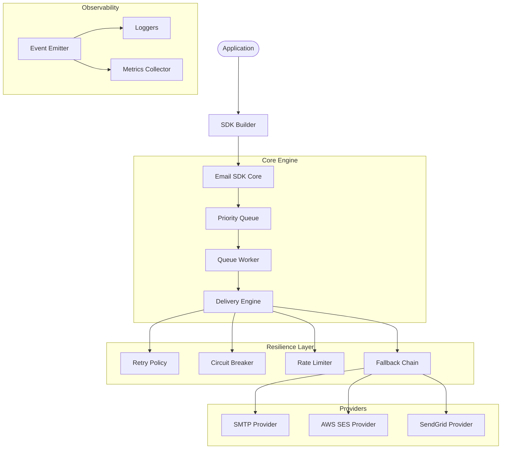

# Email SDK: Comprehensive Project Documentation & System Design Deep-Dive

## 1. Introduction
The **Email SDK** is a provider-agnostic, enterprise-grade TypeScript library designed to handle email delivery with high reliability. Instead of coupling an application to a single vendor (like SendGrid or AWS SES), this SDK provides a unified interface with built-in resilience patterns like queuing, retries, fallbacks, and circuit breakers.

### The Problem It Solves
- **Provider Lock-in:** Switching from SMTP to AWS SES usually requires code changes.
- **Transient Failures:** Network glitches or provider downtimes cause lost emails.
- **Rate-limiting:** Sending too many emails too fast leads to 429 errors.
- **Visibility:** Understanding how many many emails succeeded, failed, or were retried.

---

## 2. High-Level Architecture
The project follows a **Modular Architecture** where each responsibility is isolated into its own component.



---

## 3. System Design Concepts Applied

This project is a showcase of various advanced system design patterns. Below is a detailed breakdown of how and where they are applied.

### 2.1 Provider Abstraction (Strategy Pattern)
- **Concept:** Define a family of algorithms, encapsulate each one, and make them interchangeable.
- **Application:** We use the `IEmailProvider` interface to define what a provider can do.
- **Where in code:** `src/providers/IEmailProvider.ts` and `src/providers/BaseProvider.ts`.
- **Benefit:** You can add a new provider (e.g., Mailgun) just by implementing the interface without touching the core logic.

### 2.2 Factory Pattern
- **Concept:** Create objects without specifying the exact class of object that will be created.
- **Application:** `EmailProviderFactory` and `TemplateFactory` handle the instantiation of providers and template engines based on configuration.
- **Where in code:** `src/providers/EmailProviderFactory.ts`.
- **Benefit:** Centralizes creation logic and simplifies the builder.

### 2.3 Async Queueing & Back-pressure
- **Concept:** Use a buffer to decouple the producer (your app) from the consumer (the email worker).
- **Application:** `EmailQueue` stores jobs. If the queue is full, it throws a `QueueFullError` (Back-pressure), preventing the system from running out of memory.
- **Where in code:** `src/queue/EmailQueue.ts`.
- **Benefit:** Handles traffic spikes smoothly.

### 2.4 Retry with Exponential Backoff & Jitter
- **Concept:** Automatically retry failed operations with increasing wait times and random "jitter" to prevent "thundering herd" problems.
- **Application:** `RetryPolicy` calculates delay as `baseDelay * 2^attempt + random_jitter`.
- **Where in code:** `src/delivery/RetryPolicy.ts`.
- **Benefit:** Increases success rate for temporary network issues.

### 2.5 Circuit Breaker Pattern
- **Concept:** Stop calling a failing service (open the circuit) to give it time to recover, then slowly allow calls again (half-open).
- **Application:** Each provider has its own `CircuitBreaker`. If a provider fails 5 times, it is bypassed for 60 seconds.
- **Where in code:** `src/delivery/CircuitBreaker.ts`.
- **Benefit:** Prevents wasting resources on a known-dead service and allows fast-failing.

### 2.6 Rate Limiting (Token Bucket Algorithm)
- **Concept:** Control the rate of requests to stay within a quota.
- **Application:** `RateLimiter` implements a token bucket. Every provider has a limit (e.g., 100/sec). If tokens are exhausted, the SDK can "wait" or "throw".
- **Where in code:** `src/delivery/RateLimiter.ts`.
- **Benefit:** Prevents being banned by providers for exceeding quotas.

### 2.7 Fallback Mechanism
- **Concept:** If a primary service fails, try the next best alternative.
- **Application:** `FallbackChain` maintains an ordered list of providers. The `DeliveryEngine` iterates through them until one succeeds.
- **Where in code:** `src/delivery/FallbackChain.ts`.
- **Benefit:** High Availability (HA). Even if AWS SES is down, the SDK can switch to SendGrid.

### 2.8 Observer Pattern
- **Concept:** Defines a one-to-many dependency between objects so that when one object changes state, all its dependents are notified.
- **Application:** `EmailEventEmitter` broadcasts events (`email.sent`, `email.failed`, etc.). Loggers and Metrics Collectors listen to these events.
- **Where in code:** `src/events/EmailEventEmitter.ts`.
- **Benefit:** Decouples core logic from side effects like logging or analytics.

### 2.9 Dependency Injection (DI) & Builder Pattern
- **Concept:** Supply objects that a class needs rather than having it create them. Use a Builder for complex configuration.
- **Application:** `SDKBuilder` wires all components (queue, workers, retries) together. `EmailSDK` receives all its dependencies in the constructor.
- **Where in code:** `src/core/SDKBuilder.ts`.
- **Benefit:** Highly testable and configurable.

---

## 4. Technical File Structure

| Directory | Purpose |
| :--- | :--- |
| `src/core` | Entry points and orchestration (`EmailSDK`, `SDKBuilder`). |
| `src/providers` | Implementations for different email vendors (SES, SMTP, etc.). |
| `src/delivery` | The "brain" of the SDK handling retries, breakers, and limits. |
| `src/queue` | Logic for storing and processing emails in the background. |
| `src/templates` | Support for Handlebars/Mustache email templates. |
| `src/events` | Logging and event broadcasting logic. |
| `src/analytics` | Health checking and metrics collection. |
| `src/types` | TypeScript interfaces and enums used across the project. |

---

## 5. How to Use the SDK

### Basic Configuration
```typescript
const sdk = new SDKBuilder()
  .addProvider("ses", { region: "us-east-1" })
  .addProvider("smtp", { host: "mail.example.com", port: 587 }, "fallback-smtp")
  .withRetry({ maxAttempts: 5 })
  .withLogging({ destinations: ["console"] })
  .build();
```

### Sending an Email
```typescript
await sdk.send({
  from: { email: "sales@company.com" },
  to: [{ email: "customer@gmail.com" }],
  subject: "Your Order Information",
  html: "<b>Thank you for your order!</b>"
});
```

---

## 6. Verification & Quality Assurance

### Automated Tests
The project uses **Vitest** for unit testing.
- `tests/unit/CircuitBreaker.test.ts`: Validates state transitions (Closed -> Open -> Half-Open).
- `tests/unit/EmailQueue.test.ts`: Checks priority-based dequeuing.
- `tests/unit/RateLimiter.test.ts`: Ensures tokens are refillled and limits are enforced.

### Real-world Examples
- `examples/basic-usage.ts`: Standard one-off send.
- `examples/with-fallback.ts`: Demonstrates automatic switching when a provider fails.
- `examples/bulk-send.ts`: Shows high-throughput background processing with metrics.

---

## 7. Future Roadmap
- [ ] **Database Persistance:** Move the queue from memory to Redis or PostgreSQL.
- [ ] **Webhooks:** Support for provider webhooks to track "Opened" or "Clicked" status.
- [ ] **Attachment Support:** Handling large file uploads via S3 links.
